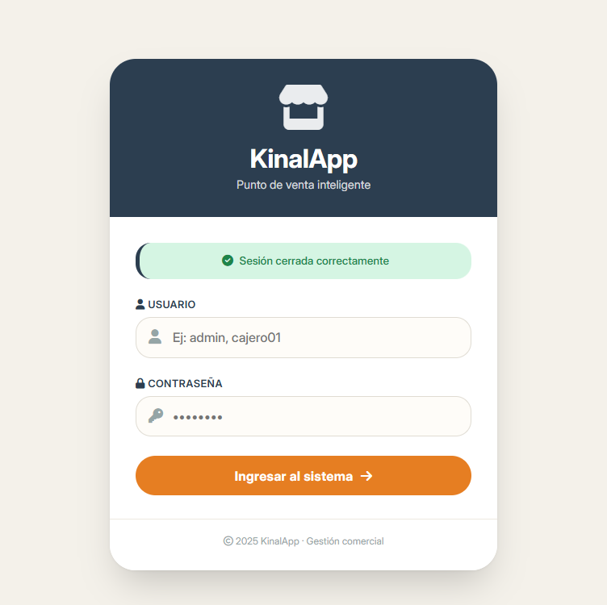
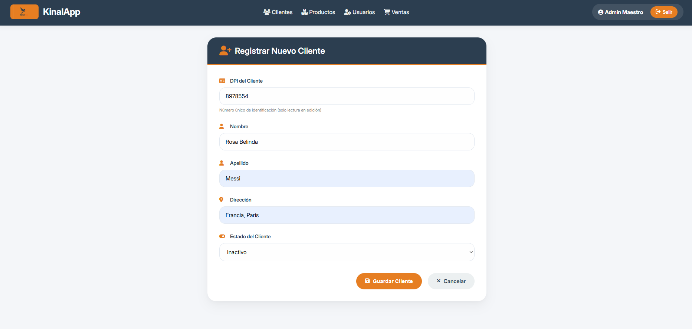
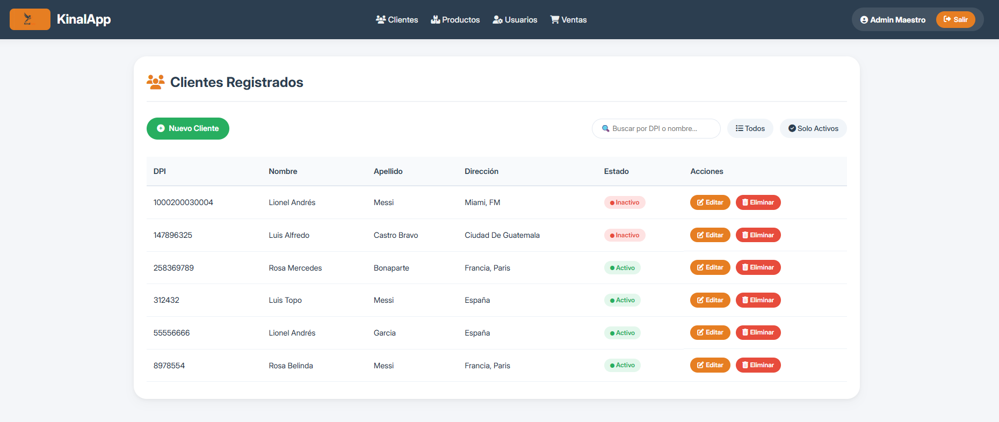
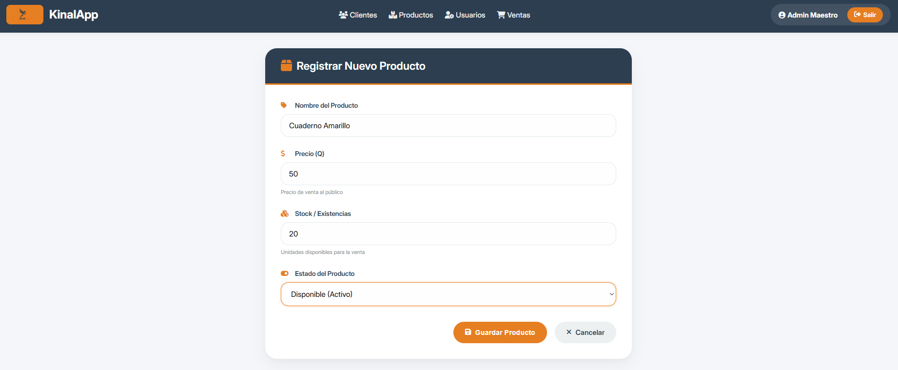
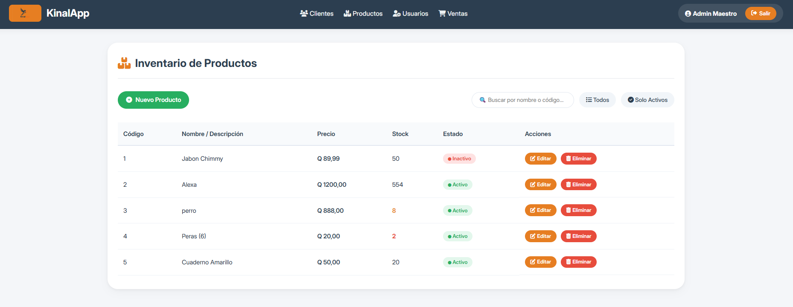
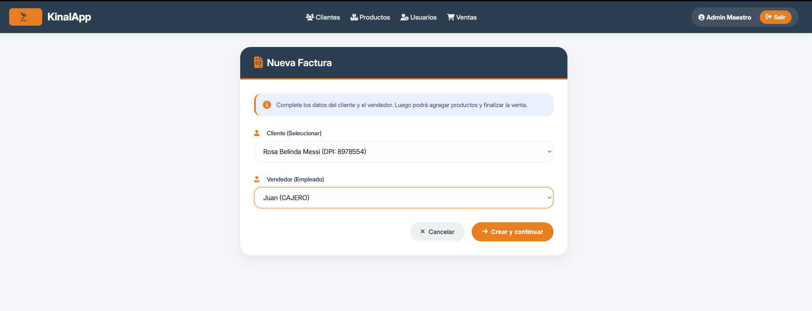
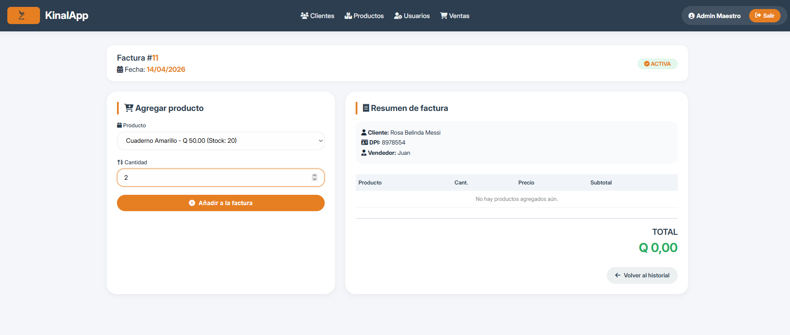
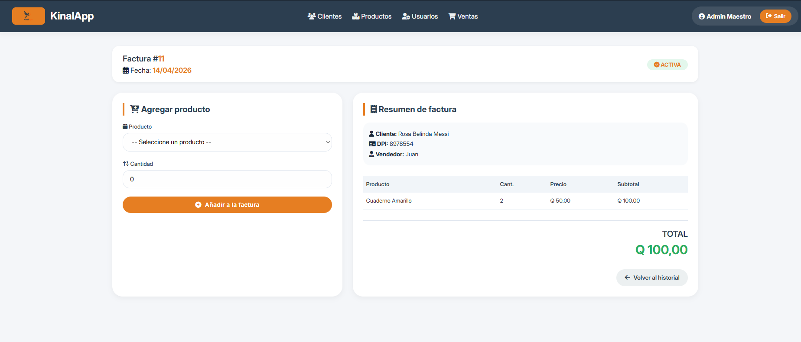

# KinalApp 
**Sistema Integral de Gestión de Inventario y Ventas (POS)**

KinalApp es una solución Full-Stack diseñada para la administración eficiente de comercios. El sistema integra un backend potente basado en una arquitectura RESTful con un frontend dinámico desarrollado en Thymeleaf, permitiendo una experiencia de usuario fluida desde el inicio de sesión hasta la facturación final.

## 🚀 Tecnologías Utilizadas

### Backend (El Motor)
* **Java 17**
* **Spring Boot 3.2.2**
* **Spring Data JPA** (Persistencia de datos)
* **Maven** (Gestión de dependencias)
* **MySQL** (Base de Datos Relacional)

### Frontend (La Interfaz)
* **Thymeleaf** (Motor de plantillas dinámicas)
* **HTML5 & CSS3** (Diseño responsivo y personalizado)
* **Bootstrap 5 & FontAwesome** (Estilizado y componentes visuales)
* **JavaScript** (Validaciones y animaciones de UI)
##  Acceso al Sistema (Credenciales)

Para facilitar las pruebas en entornos nuevos o migraciones de base de datos, el sistema cuenta con un **Usuario Maestro** de respaldo configurado directamente en el controlador de autenticación:

* **Usuario:** `admin`
* **Contraseña:** `admin123`

---

##  Arquitectura del Proyecto (Capa por Capa)

El proyecto sigue el patrón de diseño **MVC (Modelo-Vista-Controlador)**, organizado de la siguiente manera:

### 1. Capa de Entidad (Model/Entity)
Define la estructura de las tablas en MySQL mediante **JPA (Jakarta Persistence)**.
* **Ejemplo:** La entidad `Venta` mapea campos como fecha, total y estado, estableciendo relaciones de tipo `ManyToOne` con Clientes y Usuarios para la integridad referencial.

### 2. Capa de Repositorio (Persistence)
Utiliza **Spring Data JPA** para la comunicación con la base de datos.
* **Funcionalidad:** Implementa interfaces como `UsuarioRepository` que permiten realizar operaciones CRUD y consultas personalizadas, como la búsqueda de registros por su estado activo.

### 3. Capa de Servicio (Business Logic)
Es el núcleo del sistema donde se aplican las reglas de negocio y validaciones antes de persistir los datos.
* **Validaciones Estrictas:** Los servicios como `ProductoService` impiden el registro de precios negativos o nombres vacíos.
* **Gestión de Inventario:** El `DetalleVentaService` descuenta automáticamente el stock del producto al realizar una venta y valida que existan unidades suficientes en bodega.

### 4. Capa de Controlador (Orchestration)
Maneja las peticiones HTTP y la navegación entre vistas.
* **UX Mejorada:** Tras crear la cabecera de una factura, el controlador redirige al usuario directamente al Punto de Venta para agilizar el proceso.
* **Manejo de Errores:** En caso de fallos de validación, el controlador retiene los datos en el formulario para evitar que el usuario deba reescribirlos.

### 5. Capa de Vista (Frontend)
Utiliza el motor de plantillas **Thymeleaf** para renderizar contenido dinámico.
* Integración de componentes de Bootstrap para el diseño visual y FontAwesome para la iconografía profesional.

---

## 🔐 Seguridad y Control de Acceso (RBAC)

El sistema implementa un modelo de **Control de Acceso Basado en Roles (RBAC)** mediante **Spring Security**, asegurando que cada usuario acceda únicamente a las funciones permitidas según su cargo.

### Definición de Roles
1.  **ADMINISTRADOR:** Posee control total sobre el sistema, incluyendo gestión de personal, configuración de precios y auditoría de ventas.
2.  **CAJERO:** Rol operativo enfocado en la atención al cliente y ejecución de ventas. Tiene restringido el acceso a configuraciones críticas.

### Matriz de Permisos y Rutas Protegidas
| Módulo | Funcionalidad | Acceso |
| :--- | :--- | :--- |
| **Usuarios** | CRUD completo de empleados | Solo Administrador |
| **Productos** | Crear, editar y eliminar catálogo | Solo Administrador |
| **Ventas** | Anular facturas (Seguridad fiscal) | Solo Administrador |
| **Clientes** | Eliminar registros de clientes | Solo Administrador |
| **General** | Dashboard, Listar catálogos, Realizar Ventas | Todos los Roles |

### Implementación Técnica
*   **Seguridad de Capa:** Configuración de `SecurityFilterChain` para restricción física de URLs.
*   **Interfaz Adaptativa:** Uso de lógica condicional en Thymeleaf para ocultar botones de acción (Editar/Eliminar) a usuarios sin permisos.
*   **Manejo de Intrusiones:** Implementación de una página personalizada de **Acceso Denegado (403)** para intentos de acceso no autorizado.

---

## 🖼️ Guía de Funcionamiento y Vistas

| Módulo | Captura de Imagen (Colocar Aquí)                                           | Funcionamiento Detallado |
| :--- |:---------------------------------------------------------------------------| :--- |
| **Login** | **                                                      | Pantalla de seguridad con validación de sesión. Si las credenciales fallan, muestra una alerta dinámica de error. |
| **Gestión de Usuarios** | * *                          | Listado de empleados con filtros para ver solo activos o todos. Permite la creación y edición, requiriendo un correo con formato válido. |
| **Inventario de Productos** | * *                          | Catálogo de mercancía con control de stock. El frontend restringe mediante `min="0"` que se ingresen cantidades negativas. |
| **Punto de Venta (POS)** | *   * | **Módulo interactivo:** Permite seleccionar productos y agregarlos a la factura actual. El sistema suma los subtotales automáticamente y bloquea la edición si la factura es marcada como "Anulada". |

---

---
**Desarrollado por:** André Paolo García Valdéz - Carné 2022075  
*5to Perito en Informática A - KINAL*